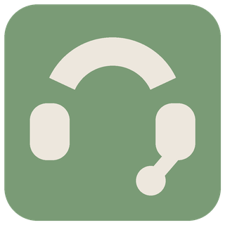
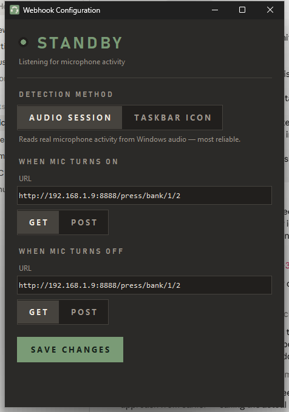
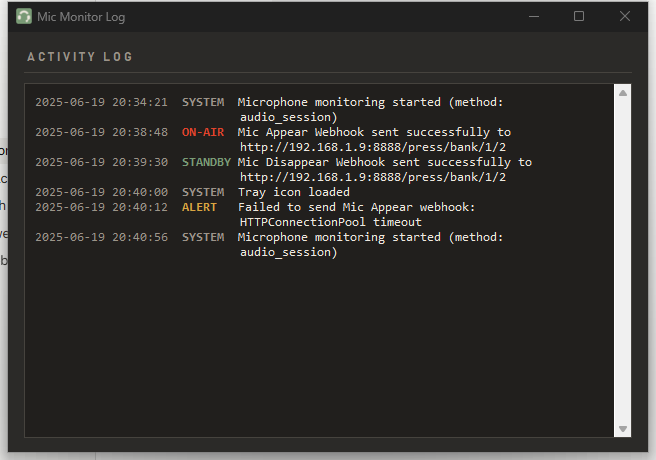

Trigger a "do not disturb" light for your home office automatically, no button press required.

I have a light plugged into a smart outlet outside my office door, which I use to signal that I'm in a call or meeting. The problem: I kept forgetting to turn it on. I looked for an existing tool that could do this automatically and couldn't find one, so I built Mic Monitor and have since enhanced it with help from AI.

The tool is a Python script packaged as a standalone executable (via PyInstaller). It watches for microphone activity and fires a webhook the moment your mic goes live. You can use this with a smart outlet to turn on a light automatically or trigger any automation you like via Bitfocus Companion or Home Assistant. In my setup, the webhook hits Bitfocus Companion, which in turn controls a TP-Link Kasa smart outlet — but since it's just a webhook, it can be pointed at any service that accepts a webhook.

## Download

[](https://github.com/WebHeadNC/Mic-Monitor/raw/main/Mic_Monitor_v4.exe)

The repository also includes the original Python source (`mic-monitor.py`) in case you want to make changes, but you don't need it to run the app — everything is contained in a single exe file.

## How it works

Mic Monitor sits quietly in your system tray and watches your microphone. The tray icon itself tells you the current state at a glance:

<table>
<tr>
<td align="center" valign="top" width="50%">
<br>
<b>STANDBY</b><br>
<sub>Microphone isn't in use. Icon stays green.</sub>
</td>
<td align="center" valign="top" width="50%">
<br>
<b>ON AIR</b><br>
<sub>Your mic's live. Icon turns red and your webhook fires.</sub>
</td>
</tr>
</table>

Right-click the tray icon any time to open the Webhook Editor, view the log, or exit.

## Configuring it

The Webhook Editor is where you set this up:



The status panel at the top isn't just decoration — it reads the same live signal the detection loop uses, so if something isn't triggering correctly, you can watch it update in real time instead of guessing.

**Webhook URLs.** Set a separate URL and HTTP method (GET or POST) for when your mic turns on and when it turns off. These are what actually control your smart outlet, light, or whatever you've wired up.

**Detection Method.** Choose how Mic Monitor decides your mic is active:

- **Audio Session (recommended)** — reads the actual capture state from Windows Core Audio (WASAPI) via `pycaw`. This checks whether any application is really recording, so it isn't affected by taskbar rendering or UI lag.
- **Taskbar Icon** — the original method, which looks for the microphone icon in the taskbar using UI Automation. Kept as a fallback.

Click **Save Changes** and everything here — both webhook URLs and your chosen detection method — persists across restarts, so you only need to set it up once.

## Troubleshooting with the log

Every event — mic transitions, webhook sends, errors — gets a timestamped line, color-coded by what it means: red when the mic goes live, green when it goes quiet, amber for real failures, and everything routine dimmed out of the way. The log window auto-refreshes, so you can leave it open during a call and watch it react live.



## Running the executable

Download **`Mic_Monitor_v4.exe`**. The icon is embedded, so it's fully self-contained — a single file with no other downloads required.

1. **Put the exe in its own folder** (for example `C:\Tools\MicMonitor\`). The app writes its log and settings files next to itself, so giving it a dedicated folder keeps those alongside the exe and out of a cluttered directory like Downloads. Avoid protected locations such as `C:\Program Files`, where Windows may block those writes.
2. **Double-click `Mic_Monitor_v4.exe`** to launch it. It runs in the taskbar tray — right-click the tray icon to open the Webhook Editor, view the log, or exit.

## Start automatically with Windows

To have Mic Monitor launch every time you sign in, add a shortcut to your Startup folder:

1. Right-click **`Mic_Monitor_v4.exe`** and choose **Show more options → Send to → Desktop (create shortcut)**. (Or right-click the exe and pick **Create shortcut**.)
2. Press **Win + R**, type `shell:startup`, and press **Enter**. This opens your personal Startup folder:
   `%AppData%\Microsoft\Windows\Start Menu\Programs\Startup`
3. Move the shortcut you created into that Startup folder.

The app will now start automatically the next time you sign in. To stop it from auto-starting, delete the shortcut from the Startup folder (or disable it under **Task Manager → Startup apps**).

> Note: leave the exe in its dedicated folder and point the shortcut at it there — don't move the exe into the Startup folder itself, or its log/config files will be written into that folder too.

## Running from source

Install the dependencies and run the script:

```
pip install -r requirements.txt
python mic-monitor.py
```

Dependencies: `pywinauto`, `pystray`, `Pillow`, `requests`, and `pycaw` (for the Audio Session detection method).

## License

[GPLv3](LICENSE)
